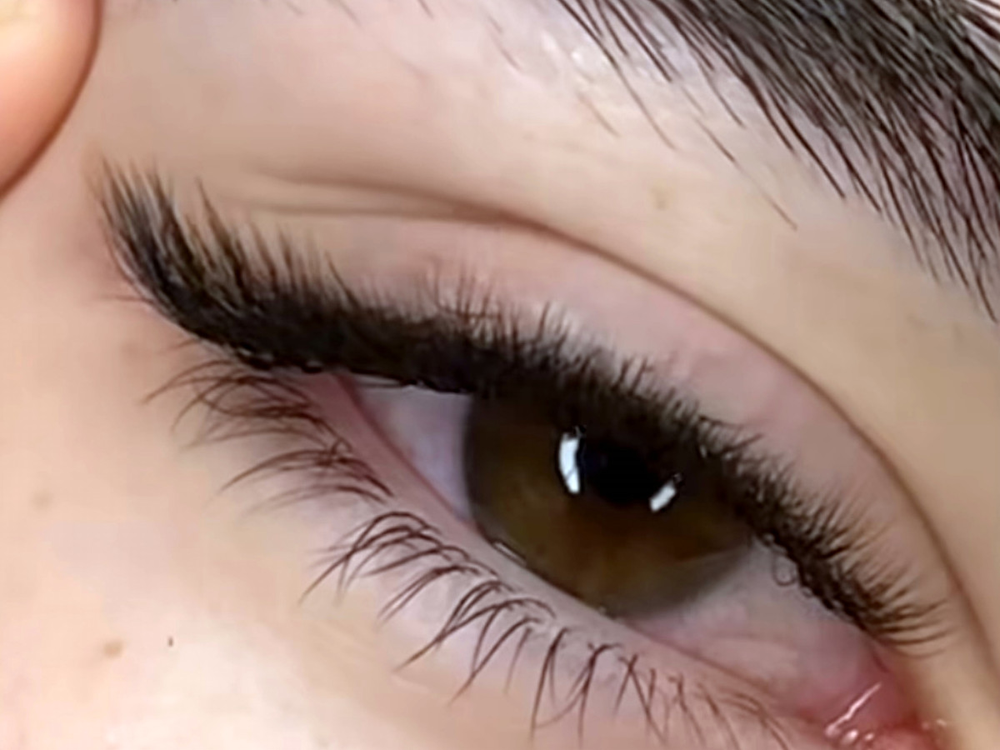

# Site da Bruna Carvalho Beauty

Site estático de 2 páginas, pronto pro GitHub Pages. Sem build, sem dependência.

## Arquivos

```
index.html        página única. Os 13 procedimentos com o valor à vista;
                  toca num e abre foto, descrição, tempo e o botão de
                  agendar. Abrir um fecha o anterior.
dados.py          fonte única dos procedimentos (nome, valor, descrição,
                  tempo). Alterou aqui, roda `python3 gera.py`.
assets/styles.css visual das duas páginas
assets/app.js     links do WhatsApp + eventos do pixel  <- EDITE AQUI
assets/marca.webp símbolo da logo
assets/bruna.webp foto da Bruna (avatar do "meu jeito de atender")
assets/fotos/     uma foto por procedimento (nomes no LEIA-ME.txt de lá)
```

## Publicar

1. Subir o conteúdo desta pasta na raiz do repositório.
2. Settings → Pages → Branch `main` / `root`.
3. Apontar o domínio do Registro.br (mesmo esquema do outro projeto).

## Onde mexer

**Telefone, mensagens do WhatsApp e links** → `assets/app.js`, bloco `CONFIG` no topo.
**Procedimentos (valor, descrição, tempo)** → `dados.py`. Depois rode
`python3 gera.py` para reescrever a lista no `index.html`.
## Pixel

Pixel `1607709067684946` (Pixel de CA - Bruna Carvalho), já instalado nas duas páginas.

Eventos que a página dispara:

| Onde | Evento padrão | Evento personalizado |
|---|---|---|
| Abrir qualquer página | PageView | — |
| Abrir um procedimento na lista | ViewContent | VerFoxEyes, VerLabial, VerBrowLamination… |
| CTA principal / barra fixa | Schedule | AgendarWhatsApp |
| Agendar um procedimento | Contact | AgendarVolumeNatural, AgendarFoxEyes, AgendarLabial… |
| Ver valores | ViewContent | VerValores |
| Como chegar | — | ComoChegar |
| Avaliar no Google | — | AvaliarGoogle |

## Links com origem (UTM)

O mesmo endereço em cada lugar, mudando só o `utm_source`. A origem entra
automaticamente na mensagem do WhatsApp ("Vim pelo Instagram"), então a Bruna
sabe de onde a pessoa veio sem olhar relatório nenhum.

| Onde | Link |
|---|---|
| Bio do Instagram | `SEU-DOMINIO/?utm_source=instagram` |
| Google — campo Agendamentos | `SEU-DOMINIO/?utm_source=gmn` |
| Google — campo Site | `SEU-DOMINIO/?utm_source=google` |
| QR do catálogo impresso | `SEU-DOMINIO/?utm_source=impresso` |
| WhatsApp Business (site) | `SEU-DOMINIO/?utm_source=whatsapp` |

## A confirmar com a Bruna antes de publicar

- [ ] **Preço da manutenção** dos cílios (não está na tabela)
- [ ] Micropigmentação labial: o retoque de 45 dias está incluso no R$ 550?
- [ ] Se cobra sinal para micro labial

---

# Como atualizar

## Trocar ou colocar a foto de um procedimento

O caso mais comum, e não mexe em código nenhum.

1. Abra `assets/fotos/` no repositório.
2. Suba a foto com o **nome exato** do procedimento — a lista completa está
   no `LEIA-ME.txt` dessa pasta (ex.: `fox-eyes.jpg`, `volume-natural.jpg`).
3. Commit. Pronto.

Para **trocar** uma foto, suba outro arquivo com o mesmo nome por cima.
Para **tirar** a foto de um procedimento, apague o arquivo — o bloco da foto
some sozinho e o resto continua funcionando.

Formato: horizontal 4:3 (ex.: 1200x900), até 250 KB, sempre `.jpg`.

## Mudar preço, descrição ou tempo

Você tem dois caminhos. Os dois chegam no mesmo lugar.

**Caminho A — direto no `index.html`** (não precisa instalar nada)

Procure o nome do procedimento no arquivo. Cada um é um bloco assim:

```html
<details class="pr" id="p-fox-eyes" data-proc="fox-eyes">
  <summary>
    <span class="pn">Fox Eyes</span>          <!-- nome -->
    <span class="pv">R$ 190</span>            <!-- valor -->
    <span class="pchev" aria-hidden="true"></span>
  </summary>
  <div class="pd">
    <div class="pfoto vazia">
      
    </div>
    <p class="pm">Para quem ama um olhar…</p>  <!-- descrição -->
    <div class="specs">
      <span><i>Sessão</i>&nbsp;2h</span>       <!-- etiquetas -->
      <span><i>Manutenção</i>&nbsp;15 a 20 dias</span>
    </div>
    <a class="agendar" href="#" data-wa="fox-eyes" data-ev="ag-fox-eyes">…</a>
  </div>
</details>
```

Troque só o texto entre as tags. Não mexa nos `class`, `id`, `data-wa`
nem `data-ev`.

**Caminho B — pelo `dados.py`** (precisa de Python no computador)

Edite `dados.py`, que é a fonte única, e rode:

```
python3 gera.py
```

Ele reescreve a lista inteira do `index.html`. É o caminho seguro quando
a mudança é grande.

## Acrescentar um procedimento novo

1. Escolha um **id**: minúsculo, sem acento, com hífen no lugar do espaço.
   Ex.: "Volume Russo" -> `volume-russo`.
2. Em `dados.py`, copie um bloco existente dentro do grupo certo
   (Cílios, Sobrancelhas ou Lábios) e troque `id`, `nome`, `val`,
   `desc` e `specs`.
3. Em `assets/app.js`, acrescente a mensagem do WhatsApp dele dentro de
   `CONFIG.mensagens` — **esse passo é obrigatório**, senão o botão abre
   com a mensagem genérica:

```js
"volume-russo": "Oi, Bruna! Quero agendar o Volume Russo.",
```

4. Rode `python3 gera.py`.
5. Suba a foto `assets/fotos/volume-russo.jpg`.

Os eventos do pixel (`VerVolumeRusso`, `AgendarVolumeRusso`) passam a
disparar sozinhos — não precisa cadastrar nada. Só lembre de criar a
conversão personalizada no gerenciador se for otimizar campanha por ele.

## Remover um procedimento

Apague o bloco em `dados.py` (ou o `<details>` inteiro no `index.html`) e
rode `python3 gera.py`. A mensagem em `app.js` e a foto podem ficar — não
atrapalham. Se quiser limpar, apague também.

## Regra de ouro

O **id** amarra tudo: o nome do arquivo da foto, a chave da mensagem no
`app.js` e o nome do evento no pixel. Se o id não bater nos três lugares,
a foto não aparece ou a mensagem sai genérica. Sempre confira os três.
